# 🤖 MCP Copilot — AI Database Agent

> Talk to your database in plain language using **Groq AI + Supabase + MCP Protocol**

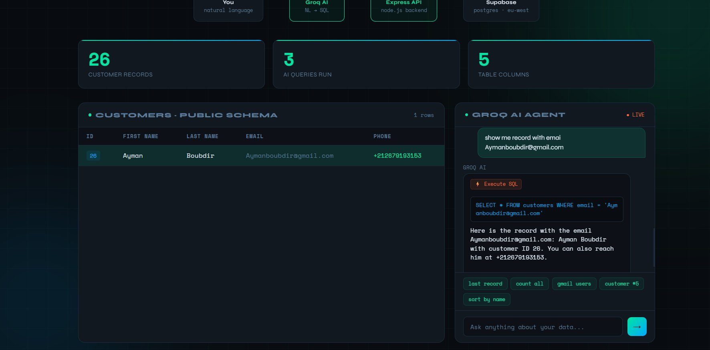

---

## 📌 Overview

**MCP Copilot** is a mini project that demonstrates the concept of an **AI Agent** using the **Model Context Protocol (MCP)**. It allows you to query a real PostgreSQL database hosted on Supabase using natural language — no SQL knowledge required.

The AI (powered by **Groq / LLaMA 3.3 70B**) translates your plain English questions into SQL, executes them on Supabase, and explains the results in a clean web dashboard.

---

## 🏗️ Architecture

```
You (Natural Language)
        ↓
   Groq AI (NL → SQL)
        ↓
  Express API (Node.js)
        ↓
Supabase (PostgreSQL · eu-west-1)
        ↓
   Web Dashboard (nginx)
```

---

## 🛠️ Tech Stack

| Layer | Technology |
|---|---|
| AI Model | Groq — LLaMA 3.3 70B Versatile (free) |
| Backend | Node.js + Express |
| Database | Supabase (PostgreSQL) |
| Frontend | HTML + CSS + Vanilla JS |
| Server | nginx |
| DevOps | Docker + Docker Compose |
| MCP Server | @supabase/mcp-server-supabase |

---

## 📁 Project Structure

```
MCPAgentProject/
├── .vscode/
│   └── mcp.json              # MCP server config (gitignored)
├── Dockerfile.backend        # Node.js container
├── Dockerfile.frontend       # nginx container
├── docker-compose.yml        # Orchestration
├── nginx.conf                # Reverse proxy config
├── server.js                 # Express + Groq + Supabase
├── package.json
├── index.html                # Dashboard UI
├── .env                      # API keys (gitignored)
└── .gitignore
```

---

## 🚀 Getting Started

### 1. Prerequisites
- Docker Desktop installed
- Supabase account
- Groq API key (free at [console.groq.com](https://console.groq.com))

### 2. Clone the repo
```bash
git clone https://github.com/yourusername/MCPAgentProject.git
cd MCPAgentProject
```

### 3. Configure environment
Create a `.env` file in the root:
```env
SUPABASE_URL=https://your-project.supabase.co
SUPABASE_ANON_KEY=eyJ...
GROQ_API_KEY=gsk_...
```

### 4. Create Supabase RPC function
Run this in your Supabase **SQL Editor**:
```sql
CREATE OR REPLACE FUNCTION execute_query(sql_query text)
RETURNS json
LANGUAGE plpgsql
SECURITY DEFINER
AS $$
DECLARE
  result json;
BEGIN
  EXECUTE 'SELECT json_agg(t) FROM (' || sql_query || ') t' INTO result;
  RETURN COALESCE(result, '[]'::json);
END;
$$;
```

### 5. Run with Docker
```bash
docker compose up --build
```

### 6. Open in browser
```
http://localhost:8080
```

---

## 📸 Screenshots

### Step 1 — Supabase Project Created
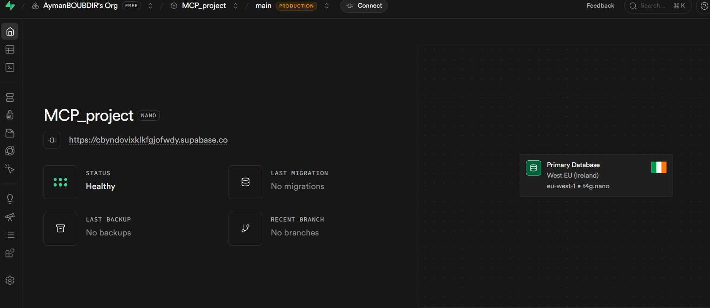

### Step 2 — Database Schema Reference
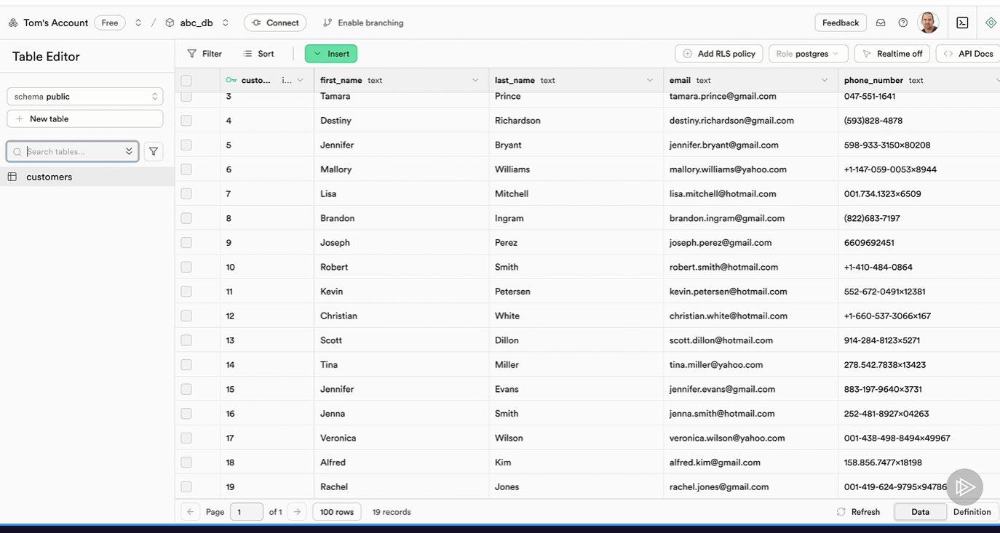

### Step 3 — SQL Script in Supabase Editor
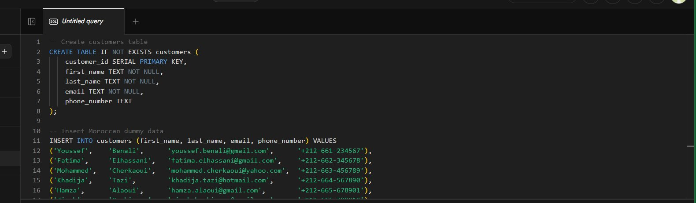

### Step 4 — Data Inserted Successfully
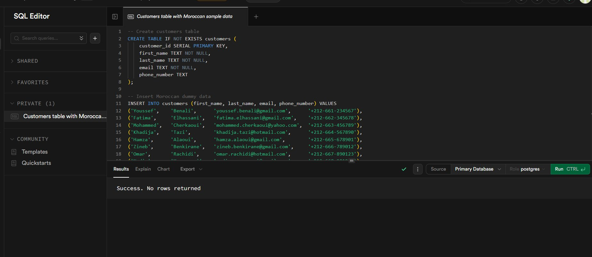

### Step 5 — Customers Table with Moroccan Data
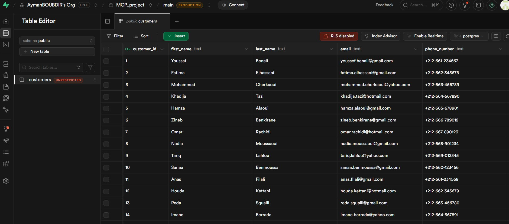

### Step 6 — MCP Server Connected in VSCode
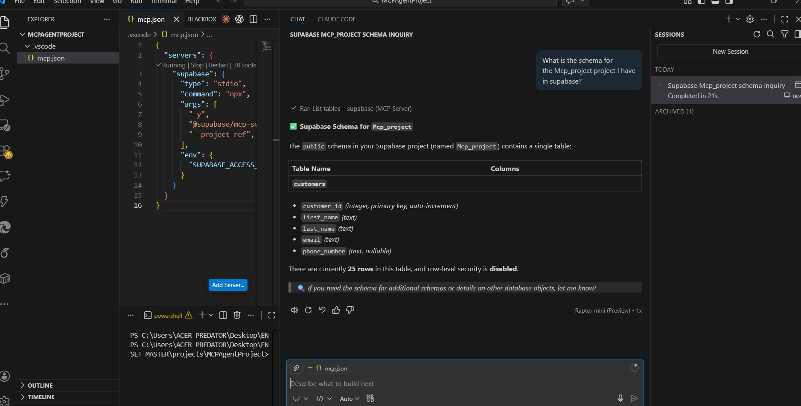

### Step 7 — AI Querying Database via MCP in VSCode
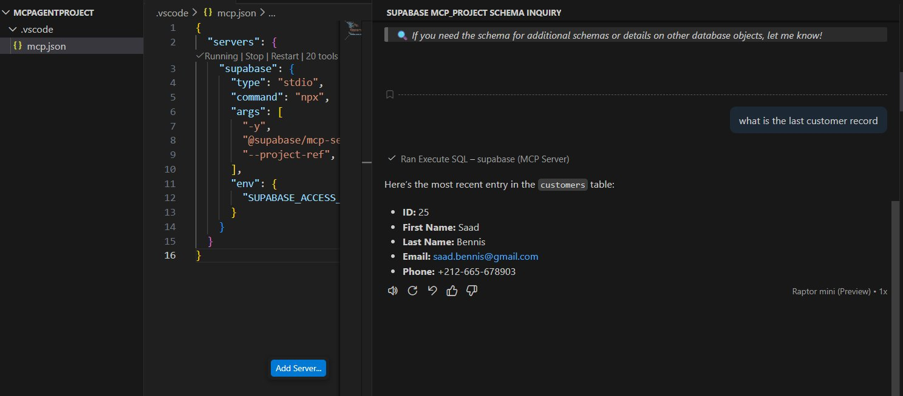

### Step 8 — Live Dashboard with Groq AI


### Step 9 — Project Structure in VSCode
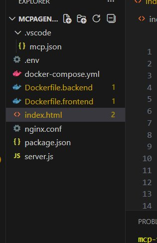

### Step 10 — MCP Agent Inserts a Record via Natural Language (VSCode)
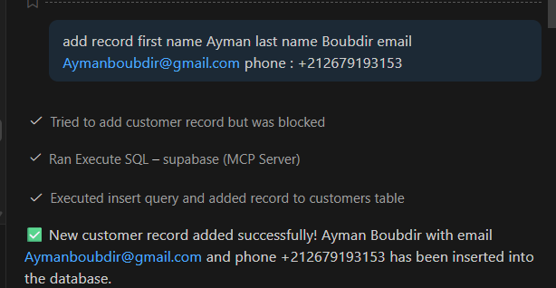

### Step 11 — Live Dashboard: Groq AI (LLaMA 3.3 70B) via Express API — 28 Queries Run,
> Natural language → Groq generates SQL → Express backend executes on Supabase → Results rendered live
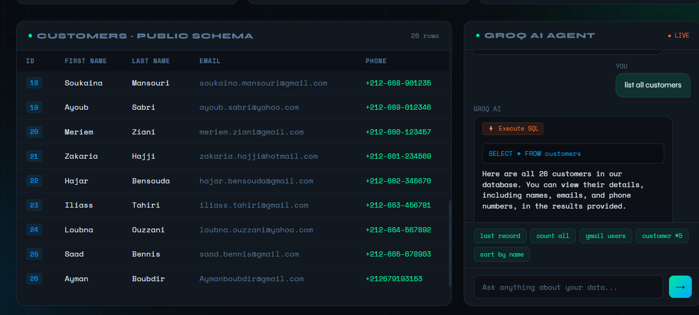

---

## 🔌 MCP Server Configuration (VSCode)

The project also includes a VSCode MCP server config that connects AI assistants (Copilot, Blackbox) directly to your Supabase database:

```json
{
  "servers": {
    "supabase": {
      "type": "stdio",
      "command": "npx",
      "args": [
        "-y",
        "@supabase/mcp-server-supabase@latest",
        "--project-ref", "your-project-ref"
      ],
      "env": {
        "SUPABASE_ACCESS_TOKEN": "your-access-token"
      }
    }
  }
}
```

---

## 💡 Example Queries

Once running, try asking the AI agent:

- `"Show the last customer record"`
- `"How many customers are there?"`
- `"Show all customers with Gmail emails"`
- `"Who is customer number 5?"`
- `"Show all customers ordered by last name"`

---

## 👨‍💻 Author

**Ayman BOUBDIR**  · 2025

---

## 📄 License
